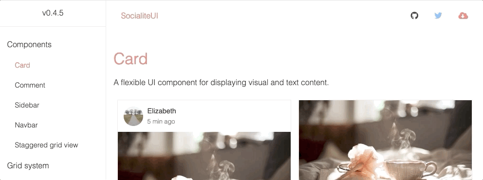
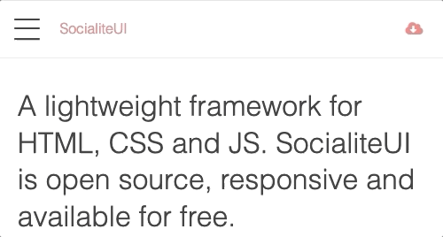

# [SocialiteUI](https://socialiteui.com) [](https://twitter.com/intent/tweet?url=https%3A%2F%2Fsocialiteui.com&via=isradeleon&text=An%20alternative%20CSS%20framework%20for%20responsive%20WEB%20design&hashtags=responsive%2Cdesign%2Cframework%2Ccss%2Csocialiteui)

Lightweight HTML, CSS and JS framework for responsive WEB design. SocialiteUI is open source, and available for free.

[](https://www.npmjs.com/package/socialiteui)
[](https://www.npmjs.com/package/socialiteui)
[](LICENSE)
[](https://www.npmjs.com/package/socialiteui)

<a href="https://socialiteui.com">
    
</a>

## Easy to install

You may just install the framework from npm or download the current version from [here](https://github.com/Isradeleon/socialiteui/archive/0.4.5.zip). Then just import the minified CSS and JS files into your project.

### NPM

```sh
npm install socialiteui
```

**Here is a code snippet:**

```html
<!-- Import the styles -->
<link rel="stylesheet" href="socialiteui-v0.4.5/socialiteui.min.css">

<!-- Staggered grid and sidebar functionality -->
<script src="socialiteui-v0.4.5/socialiteui.min.js"></script>
```

## Components

The framework includes the next list of components:

* [Staggered grid view](https://socialiteui.com/staggered.html)

[**Sidebar**](https://socialiteui.com/sidebar.html)  


[**Navbar**](https://socialiteui.com/navbar.html)  


* [Card](https://socialiteui.com/card.html)
* [Comment](https://socialiteui.com/comment.html)

## Grid system

The framework comes with a legible and easy to learn [grid system](https://socialiteui.com/grid-system.html). Here is a little code sample for defining the columns size on desktop, mobile and tablet:

```html
<div class="grid">
    <div class="col-6 tablet-12 mobile-6">
        ...
    </div>
    <div class="col-6 tablet-12 mobile-6">
        ...
    </div>
</div>
```

## Lightweight

The whole framework weighs just 17K.

## Browser Support

The framework is compatible with recent versions of:

* Firefox
* Chrome
* Safari
* Edge
* Opera
* Partial support for Internet Explorer

## Built with

* [Flexbox](https://developer.mozilla.org/en-US/docs/Web/CSS/CSS_Flexible_Box_Layout/Using_CSS_flexible_boxes) Flexible Box Module
* [Autoprefixer](https://github.com/postcss/autoprefixer) for better browser support
* [CSSO](https://github.com/css/csso) CSS compressor
* [Terser](https://github.com/terser-js/terser) JS compressor

## Documentation

Currently working to improve the [documentation](https://socialiteui.com). You'll find the documentation inside the website folder. The docs are generated using [Nunjucks](https://github.com/mozilla/nunjucks) and saved to **../socialiteui-docs/**.

## License

This library is licensed under `MIT license`. View [license](LICENSE).